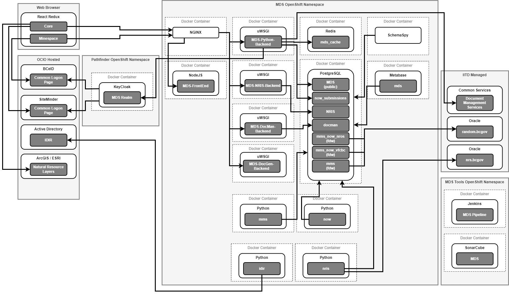

# Mines Digital Services

## Installation and Usage

This file describes how to run the project and develop against it.

## Requirements

- Git
- Docker
- Docker Compose
- NodeJS
- [Make](https://www.gnu.org/software/make/manual/make.html)

## Getting Started

- Install Requirements listed above
- On Windows, note the following:
  - If containers are not working, they may not be enabled, enabling them in docker settings and restarting the machine fixes this
  - Drive sharing is disabled by default, make sure to share your local drive in docker settings

### Developing with M1 Mac

To develop with M1 Mac, there are no additional requirements.

The make file supports context switching based on the CPU architecture of the machine host.

If you require to run additional docker-compose commands, use `docker-compose` with `-f` flag pointing to `docker-compose.M1.yaml`

### Setting up local development

// all of these are wrong
If you are developing without an IDIR, or if remote Keycloak is down, you'll
need to run a local Keycloak instance. The local development environment is
based on `.env-dev-local-keycloak`. You can make a copy of this file as `.env`
and/or run the following command to set up a local Keycloak instance.

```
make local-dev
```

If you wish to have a completely fresh environment, you can run the following
command at any time:

```
make rebuild-all-local
```

NOTE: Always wait for all commands to complete before running subsequent
commands.

### Troubleshooting

// also wrong
Should anything go awry with the above commands, you may wish to isolate the
failure by running individual commands. A common setup for contributors is to
run the frontend on the host machine and everything else in Docker. To do so,
execute the following commands:

```
$ make clean
$ make keycloak
$ make backend
$ make keycloak-user
$ make generate-rand100
```

The backend is now running and seeded with random data. Run the following
commands from within the `/frontend` directory to initialize the frontend:
// there is no /frontend directory, this info is duplicated in monorepo.md but better

```
$ yarn
$ yarn serve
```

## Generating Test Data

There are two approaches to having test data in your system. If you are a
public contributor, choose "Using Flask". View the Makefile for more
information on what these commands are doing. This is useful for
troubleshooting if anything fails to work as expected.

### Seeding data

Use the following make command to seed test data locally.

```
make seeddb
```

## Developing workflow tips for MDS

You may choose to use a version manager such as [nvm](https://github.com/nvm-sh/nvm) or [asdf](https://asdf-vm.com/) if working on multiple projects.

### Browser Caching

If you are rebuilding often, you may encounter browser caching.

To address this, you may:

- Periodically clear the cache.
- Disable cache (available in Chrome/Chromium)
- Open an Incognito window (Chrome/Chromium)

### Using the Document Manager and Document Generator locally

If you are running the frontend using yarn serve then you will not be able to use the document manager at the same time as the document generator. If you wish to do this then you need to make an addition to your hosts file so the browser can resolve the document_manager_backend to localhost.

If you are on a windows machine ensure that you open powershell in administrator mode as that is required to modify the hosts file and run the following command at the root of this project:

```
.\AddHosts.ps1 -Hostname document_manager_backend -DesiredIP 127.0.0.1 -CheckHostnameOnly $true
```

This will add an entry for the document manager backend if it does not currently exist.

On a mac or linux run the following in the bin directory:

```
sudo ./AddHosts.sh add 127.0.0.1 document_manager_backend
```

you will be prompted for your sudo password if the entry does not already exist.

## Architecture Diagrams



## Authentication Workflow


