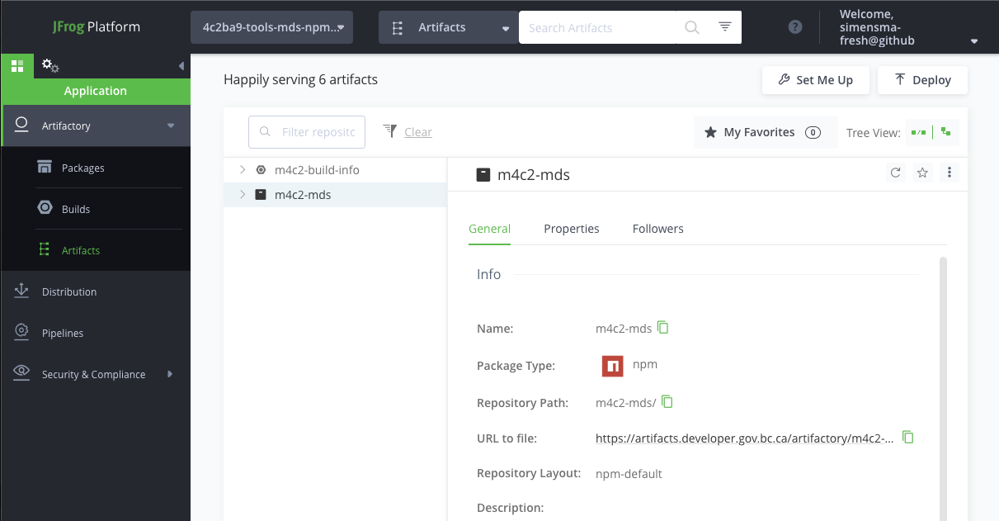
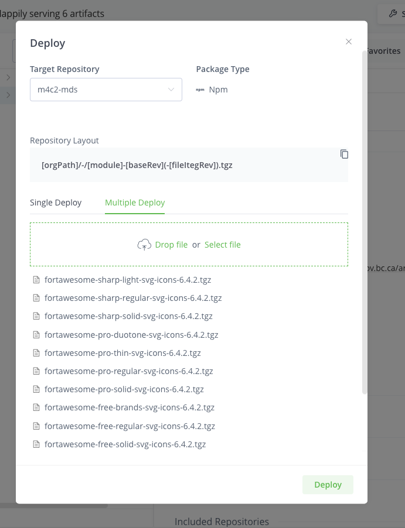

# Fontawesome setup

Core and Minespace are using FontAwesome Pro, which requires a license. The license code itself can be found in the `4c2ba9-dev` Openshift project -> Dev Secrets -> `FONT_AWESOME_PACKAGE_TOKEN`.

## Caching

FontAwesome Pro `npm` packages have a bandwith limit, so we are hosting a version of them in a bcgov [artifactory](https://artifacts.developer.gov.bc.ca/) repository to act as a cache. Project: `4cba9-tools-mds-npm-cache`. More information on the BCGOV artifactory service, including how to manage users, can be found at: [https://developer.gov.bc.ca/Artifact-Repositories-(Artifactory)](<https://developer.gov.bc.ca/Artifact-Repositories-(Artifactory)>)

## Upgrading FontAwesome

Seeing as we're caching fontawesome packages ourselves, we need to manually update them when we want to upgrade to a new version.

1. Authenticate `npm` with the FontAwesome repo. FONT_AWESOME_TOKEN is the license code described above.

```bash
npm config set "@fortawesome:registry" https://npm.fontawesome.com/
npm config set "//npm.fontawesome.com/:_auth_" <FONT_AWESOME_TOKEN>
```

2. Download fontawesome tarballs to your local machine

```bash
npm pack \
    @fortawesome/react-fontawesome@0.2.0 \
    @fortawesome/free-solid-svg-icons@6.4.2 \
    @fortawesome/free-regular-svg-icons@6.4.2 \
    @fortawesome/free-brands-svg-icons@6.4.2 \
    @fortawesome/pro-solid-svg-icons@6.4.2 \
    @fortawesome/pro-regular-svg-icons@6.4.2 \
    @fortawesome/pro-light-svg-icons@6.4.2 \
    @fortawesome/pro-thin-svg-icons@6.4.2 \
    @fortawesome/pro-duotone-svg-icons@6.4.2 \
    @fortawesome/sharp-solid-svg-icons@6.4.2 \
    @fortawesome/sharp-regular-svg-icons@6.4.2 \
    @fortawesome/sharp-light-svg-icons@6.4.2 \
    @fortawesome/fontawesome-svg-core@6.4.2 \
    @fortawesome/fontawesome-pro@6.4.2 \
    @fortawesome/fontawesome-common-types@6.4.2
```

3. Upload them to artifactory. Log into artifactory [artifactory](https://artifacts.developer.gov.bc.ca/) and navigate to the `4cba9-tools-mds-npm-cache` project. Navigate to `Artifacts` -> `m4c2-mds`. Hit Deploy, upload the packages, and hit Deploy again. You're done!



