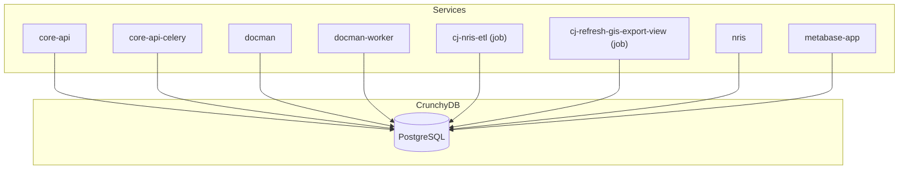

# CrunchyDB PostgreSQL Operator Setup

This document outlines the setup and configuration for the CrunchyDB PostgreSQL Operator for the MDS project

## Overview

The CrunchyDB PostgreSQL Operator manages PostgreSQL clusters deployed on Kubernetes. This setup utilizes helm for managing configurations across the dev, test, and prod environment. The operator is responsible for deploying and managing PostgreSQL clusters, including handling backups, scaling, and other database operations.

## Build

This project utilizes a custom Dockerfile (`services/crunchydb/Dockerfile`) to build a specialized CrunchyDB PostgreSQL image. The primary reason for this is to include the `oracle_fdw` (Oracle Foreign Data Wrapper) extension.

The `oracle_fdw` extension enables PostgreSQL to connect to and query Oracle databases as if they were local tables, and is used for the legacy MMS integration.

The crunchydb docker image can be built using the `crunchydb.build.dev` github action workflow. This workflow builds the Docker image and pushes it to the Openshift internal docker registry (tools namespace).

## Deployment

The CrunchyDB PostgreSQL Operator is deployed using a Helm chart based on https://github.com/bcgov/crunchy-postgres with a couple of small tweaks. The deployment is managed through ArgoCD.

crunchydb/base/charts/crunchy-postgres contains the Helm chart for the CrunchyDB PostgreSQL Operator. The chart is configured using the `values_crunchy_postgres.yaml` file.

crunchydb/base/charts/crunchy-tools contains the Helm chart for CrunchyDB tools, which sets up a couple of service accounts and roles for the operator to use. The chart is configured using the `values_crunchy_tools.yaml` file.

## Service Connections

The following services connect to the CrunchyDB PostgreSQL database:



## Common Maintenance Tasks

This section outlines common maintenance tasks for the CrunchyDB PostgreSQL Operator and its associated clusters. For more comprehensive information, refer to the [CrunchyDB PostgreSQL Operator documentation](https://access.crunchydata.com/documentation/postgres-operator/latest/).
or the [BCGov Platform Developer Docs](https://developer.gov.bc.ca/docs/default/component/platform-developer-docs/docs/database-and-api-management/postgres-how-to/).

> [!WARNING]  
> IMPORTANT!: Common tasks such as restarts, backups, restores, and scaling should always be performed by modifying the `PostgresCluster` resource, NOT on the individual pods/ Statefulset. The operator will handle these operations based on the configuration specified in the `PostgresCluster` resource, and manual changes to the pods may lead to inconsistencies or data loss.

### Backups

Backups are managed by `pgBackRest`. The configuration in `values_crunchy_postgres.yaml` defines:
- **Retention Policy**: `retention` and `retentionFullType` control how many backups are kept and for how long.
- **Backup Schedules**: `schedules` under `repos` define when full and incremental backups are performed.

**To see the current backup status:**
You can check the status of backups using the `pgBackRest` command line tool or by inspecting the `PostgresCluster` custom resource in Kubernetes.

```bash
kubectl get postgrescluster crunchy-postgres -o yaml
```
This command retrieves the current status of the `crunchy-postgres` cluster, including information about backups.
You can also check the logs of the `pgBackRest` pods to see recent backup activities:

```bash
kubectl logs -l app=pgbackrest -n <namespace>
```
This command retrieves the logs of all `pgBackRest` pods in the specified namespace, which can provide insights into backup operations and any issues encountered.


You can also check the status of backup jobs by looking at the Openshift jobs created by the operator:

```bash
oc get jobs -n <namespace> -l app=pgbackrest
oc logs job/<job-name> -n <namespace>
```

### Triggering Backups

**To manually trigger a backup:**
While the operator handles scheduled backups, manual backups can be triggered if needed. One way to do this is by using the `pgbackrest-backup` annotation on the `PostgresCluster` custom resource. 

**Example:**
```bash
kubectl annotate postgrescluster crunchy-postgres --overwrite postgres-operator.crunchydata.com/pgbackrest-backup="$(date '+%F_%H:%M:%S')"
```

This command annotates the `crunchy-postgres` `PostgresCluster` resource, triggering a new backup. The value of the annotation is used as the backup name, and using `$(date '+%F_%H:%M:%S')` creates a timestamped backup name.

Refer to the official CrunchyDB and `pgBackRest` documentation for more specific commands and options.

### Restoring from Backup

To restore a cluster from a backup:
1.  **Configure `dataSource`**: In `values_crunchy_postgres.yaml`, set `dataSource.enabled: true`.
2.  **Specify Backup Source**:
    -   If restoring from a PVC-based backup, ensure `repoName` under `standby` (if applicable for standby creation) or `dataSource.repo.name` points to the correct `pgBackRest` repository (e.g., `repo1`).
    -   If restoring from S3, ensure `dataSource.repo.name` points to the S3 repository (e.g., `repo2`) and that the `s3` block under `dataSource.repo` is correctly configured with bucket, endpoint, and region details. The `s3-pgbackrest` secret must contain the necessary S3 credentials.
3.  **Apply Configuration**: Apply the updated Kustomize configuration. The operator will then initiate the restore process.

**Note**: The `stanza` and `path` within the `dataSource.repo` configuration must match the backup you intend to restore.

### Scaling

To scale the number of PostgreSQL instances:
1.  **Modify `replicas`**: In `values_crunchy_postgres.yaml`, adjust the `instances.replicas` value.
2.  **Apply Configuration**: Apply the updated Kustomize configuration. The operator will scale the cluster accordingly.

### Restart database pods

Sometimes you need to restart the database pods, for example, after applying a configuration change or if you encounter issues with the database.

To do so, update the postgrescluster/crunchy-postgres resources `restarted` annotation:

```bash
kubectl patch postgrescluster/crunchy-postgres --type merge --patch '{"spec":{"metadata":{"annotations":{"restarted":"'"$(date)"'"}}}}'
```

### Troubleshooting
-   **PostgreSQL Pod Logs**: Check the logs of the PostgreSQL instance pods for database-specific errors.
-   **PostgresCluster Status**: Use `kubectl get postgrescluster crunchy-postgres -o yaml` to check the status of the PostgreSQL cluster and see if there are any issues reported.
-   **`pgBackRest` Logs**: If backup or restore operations fail, inspect the logs of the `pgBackRest` pods.
-   **Events**: Use `kubectl get events -n <namespace>` to see Kubernetes events that might indicate problems with pod scheduling, volume mounting, etc.

## Further Information

For more detailed information, refer to the official [Crunchy Data PostgreSQL Operator documentation](https://access.crunchydata.com/documentation/postgres-operator/latest/).

For information on using CrunchyDB in the BCGov environment, refer to the [BCGov Platform Developer Docs](https://developer.gov.bc.ca/docs/default/component/platform-developer-docs/docs/database-and-api-management/postgres-how-to/).
