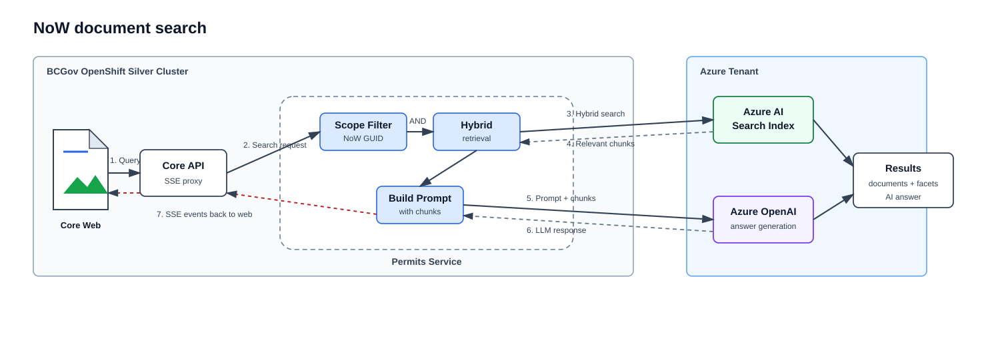
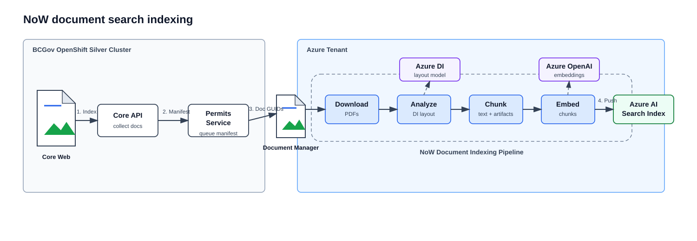
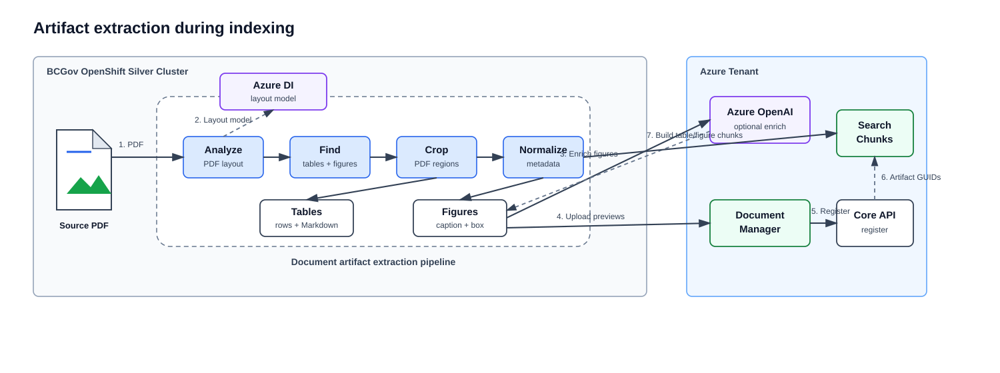

# Notice of Work Document Search

The Notice of Work (NoW) document search lets ministry users search across the documents attached to a single NoW application and receive both ranked document excerpts and an AI-generated answer. It follows the same broad Azure AI Search / Azure OpenAI pattern as [Permit Condition Search](./permit_condition_search.md), but it is scoped to unstructured application documents instead of permit condition records.

The closest architecture reference is [MDS_Permit_search.drawio.svg](../architecture/MDS_Permit_search.drawio.svg). The NoW implementation reuses the same concepts: Core Web initiates the request, Core API proxies into the permits service, Azure AI Search stores searchable chunks, and Azure OpenAI supports embeddings and answer generation.

## High-level Architecture

### Components

1. **Core Web** renders the "Search Documents" tab in the NoW application view. It owns the search box, filters, AI response panel, indexing button, progress badge, and cancel action.
2. **Core API** validates access and the NoW application, gates the feature flag, collects indexable document metadata, and proxies search/index/status/cancel calls to the permits service.
3. **Permits Service** owns the NoW document search pipeline, Azure AI Search index access, Celery indexing orchestration, and Server-Sent Events (SSE) search response stream.
4. **Document Manager** stores the original application documents and any extracted artifact preview images produced during indexing.
5. **Azure Document Intelligence** extracts text, tables, figures, page numbers, and bounding boxes from source documents.
6. **Azure OpenAI** generates embeddings during indexing and query time, and produces the final answer from retrieved document excerpts.
7. **Azure AI Search** stores text and artifact chunks with filterable metadata, then serves hybrid keyword/vector retrieval.
8. **Redis** tracks parent and child Celery task IDs so status and cancellation can be resolved per NoW application.

## User-facing Flow



The frontend handles these SSE events:

| Event | Meaning |
| --- | --- |
| `documents` | Ranked search results and facets are ready. |
| `ai_start` | The AI response is being generated. |
| `prompt` | The generated Markdown answer is available. |
| `ai_complete` | The AI response is finished. |
| `error` | Search failed and the UI should display the returned message. |

## Indexing Flow



Indexing is explicit. The user starts it from the NoW search tab, and the UI polls status while the job runs. Re-indexing is safe because chunk IDs are deterministic and existing chunks for each source document are deleted before new chunks are pushed.

Core API sends a lightweight manifest rather than uploading document bytes to the permits service. Each child Celery task downloads its own source document from Document Manager. This keeps large PDFs out of Core API request bodies and lets the permits workers process documents with bounded concurrency.

Spatial files are skipped before indexing. The excluded extensions are `.shp`, `.shx`, `.dbf`, `.prj`, `.kml`, `.kmz`, `.gdb`, `.gpx`, and `.geojson`.

## Artifact Extraction



Artifact extraction runs inside the indexing pipeline after Azure Document Intelligence analyzes the source PDF. The pipeline splits the output into text chunks and artifact chunks.

Tables are extracted from the Document Intelligence layout model. The pipeline normalizes cells into headers and rows, creates Markdown for display, keeps page and bounding box metadata, and can crop a table preview image from the source PDF.

Figures are extracted from Document Intelligence figure regions. The pipeline captures page and bounding box metadata, pulls nearby paragraph text when available, crops the figure preview image, and optionally asks Azure OpenAI to generate a concise caption, summary, and category. If multimodal enrichment is disabled or fails, the pipeline falls back to Document Intelligence captions.

Preview images are uploaded to Document Manager and registered back through Core API as artifacts of the source document. The corresponding search chunks keep artifact metadata such as type, category, page number, bounding box, table Markdown, caption, summary, and artifact Document Manager GUIDs.

## Search Scope and Isolation

The NoW application GUID is always taken from the URL path, not from the request body. The permits service injects this mandatory Azure Search filter before retrieval:

```text
now_application_guid == {guid from path}
```

Caller-supplied filters are merged underneath the mandatory GUID filter with a top-level `AND`. This means document type, artifact type, artifact category, and page filters can narrow the result set, but they cannot remove the application boundary.

## Indexed Content

The index contains plain text paragraph chunks and artifact chunks. Text chunks come from Document Intelligence paragraphs. Artifact chunks represent extracted tables and figures.

Key searchable/filterable fields include:

| Field | Purpose |
| --- | --- |
| `content` | Searchable text used for keyword, vector, and answer context. |
| `now_application_guid` | Mandatory filter for application isolation. |
| `mine_guid` | Stored for future mine-scoped search use cases. |
| `document_manager_guid` | Links the chunk back to the source document. |
| `document_name` | Display, search, sort, and facet field. |
| `document_type` | Display and facet field. |
| `submitted_date` | Display, sort, and facet field. |
| `artifact_type` | Distinguishes text, table, figure, and other extracted artifacts. |
| `artifact_category` | Categorizes extracted artifacts such as map, diagram, chart, or technical drawing. |
| `artifact_page_number` | Lets users filter and open a result at the relevant page. |
| `artifact_*bounding_box*` | Lets the document viewer jump to a region when coordinates are available. |
| `artifact_table_markdown` | Stores formatted table content for display. |
| `artifact_caption` / `artifact_summary` | Searchable artifact context shown in result cards. |
| `embedding` | Vector representation used by hybrid search. |

## Result Rendering

Search results are rendered by the NoW result item component, while the surrounding search shell reuses generic Permit Search UI pieces. A result can show:

1. Document name and normalized match score.
2. Artifact preview image when an extracted figure/table region has a Document Manager artifact URL.
3. Expandable Markdown table content for table artifacts.
4. Artifact summary and caption when available.
5. Highlighted OCR/content excerpt for plain text hits.
6. Filter tags for document type, artifact type, artifact category, and page.
7. A Document Manager link to the source document, optionally with page and bounding box metadata for viewer positioning.

Core API enriches `documents` SSE events before returning them to the browser. When a result includes `artifact_document_manager_guid`, Core API creates a Document Manager download token and resolves an `artifact_presigned_url` so the frontend can show the artifact preview.
