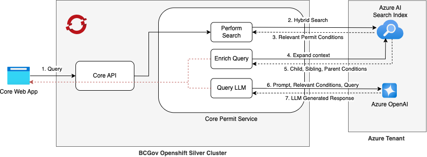
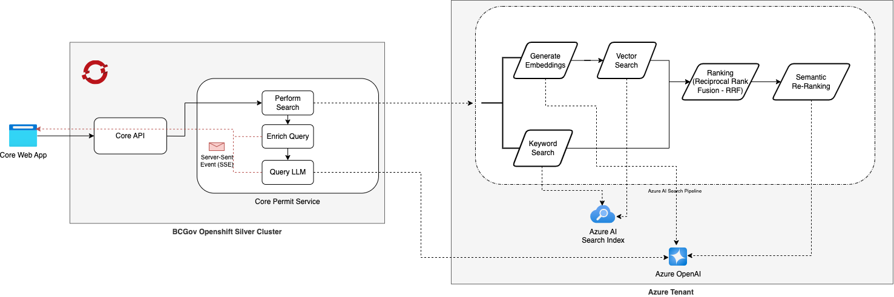
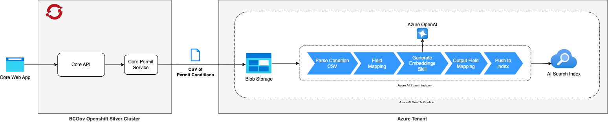

# Permit Condition Search

The MDS Permit Condition Search consists of several pipelines that work together to provide a comprehensive search experience for permit conditions. This document outlines the key components and flow of these pipelines.

The permit conditions search system is designed to handle search of permit conditions from Mines Act Permits, as extracted from PDFs (as per the process outlined in [permits/README.md](../../services/permits/README.md) and on [Confluence](https://apps.nrs.gov.bc.ca/int/confluence/display/MDS/Permit+Service+-+Architecture)) or from Regional permits issued through core.

## Permit Condition RAG

The MDS permit condition search is a [RAG (Retrieval-Augmented Generation)](https://learn.microsoft.com/en-us/azure/search/retrieval-augmented-generation-overview) system that provides AI powered search capabilities for mining permit conditions.

### Components:
1. **Core Web App**: The frontend application that initiates queries
2. **Core API**: Receives and processes search requests from the web app
3. **Core Permit Service**: Houses the search functionality with several key components:
   - **Perform Search**: Executes the initial search against Azure AI Search to retrieve relevant permit conditions.
   - **Enrich Query**: Expands the search context with additional relevant information to improve the quality of the results. This includes retrieving the sibling, parent, and child conditions of the permit conditions found in step one.
   - **Query LLM**: Constructs prompts and communicates with the LLM. This component is responsible for creating a prompt that includes the original query and the retrieved conditions, which is then sent to the Azure OpenAI service for processing.
4. **Azure AI Search Index**: Stores indexed permit condition data
5. **Azure OpenAI**: Provides LLM capabilities for generating responses
6. **Server-Sent Events**: Used to provide real-time updates to the user interface as the search progresses

### Flow:
1. User initiates a query from the Core Web App
2. Core API receives the query and forwards it to the Permit Service
3. Perform Search component executes a hybrid search against Azure AI Search
4. Azure AI Search returns relevant permit conditions
5. Enrich Query expands the context by retrieving related conditions
6. Query LLM component creates a prompt with the query and retrieved conditions
7. Azure OpenAI processes the prompt and generates a response
8. The system returns the generated response to the user via server-sent events

## Azure AI Search Pipeline

The azure AI Search pipeline handles the searching of permit conditions with a hybrid approach that combines keyword and vector (semantic) search, and uses Reciprocal Rank Fusion (RRF) to rank the results. The pipeline then re-ranks the results using semantic understanding to find the most relevant results. The search index is configured to use "built-in embeddings", which means we specify a field in the index that contains the vector embeddings, and at search time the search service will automatically generate the embeddings for the query.

### Components:
1. **Azure AI Search Pipeline**: Contains multiple search mechanisms:
   - **Generate Embeddings**: Creates vector embeddings of queries
   - **Vector Search**: Semantic search using embeddings
   - **Keyword Search**: Traditional keyword-based search
   - **Ranking (RRF)**: Combines results using Reciprocal Rank Fusion
   - **Semantic Re-Ranking**: Further refines results using semantic understanding

### Flow:
- The query flows through both keyword and vector search paths
- Results are combined using Reciprocal Rank Fusion (RRF)
- Semantic re-ranking further improves result relevance
- Real-time updates are provided to the user via server-sent events

## Permit Condition Search Indexing Pipeline

This pipeline handles the indexing of permit condition data to make it searchable. It process data exported from Core in a CSV format, and then uses Azure AI Search Indexer to parse the CSV and generate vector embeddings using Azure OpenAI. The final output is pushed to the Azure AI Search Index.

### Components:
1. **Core API**: Provides a cli to export permit conditions for a given permit as a CSV file.
1. **Permit Service**: Provides an endpoint to upload exported CSV. This uploads the CSV to Azure Blob Storage, and triggers the Azure AI Search Indexer to process the data.
2. **Blob Storage**: Stores CSV files of permit conditions
3. **Azure AI Search Indexer**: Processes the data with several steps:
   - **Parse Condition CSV**: Reads and processes the CSV data. Makes sure it's a valid CSV file.
   - **Field Mapping**: Maps CSV fields to search index fields
   - **Generate Embeddings Skill**: Creates vector embeddings using Azure OpenAI
   - **Output Field Mapping**: Finalizes field mapping for the index
   - **Push to Index**: Adds the processed data to the search index

4. **Azure OpenAI**: Generates embeddings for semantic search
5. **AI Search Index**: The destination for indexed data

### Flow:
1. CSV data exported from Core
2. CSV is uploaded to the Permit service
3. Data is sent to Azure Blob Storage
4. The Azure AI Search Indexer pipeline processes the data through multiple steps
5. Vector embeddings are generated using Azure OpenAI
6. The processed data is pushed to the AI Search Index
7. The index becomes available for search operations

## References
- [Azure AI Search Documentation](https://learn.microsoft.com/en-us/azure/search/)
- [Retrieval Augmented Generation (RAG) in Azure AI Search](https://learn.microsoft.com/en-us/azure/search/retrieval-augmented-generation-overview)
- [Semantic ranking in Azure AI Search](https://learn.microsoft.com/en-us/azure/search/semantic-search-overview)