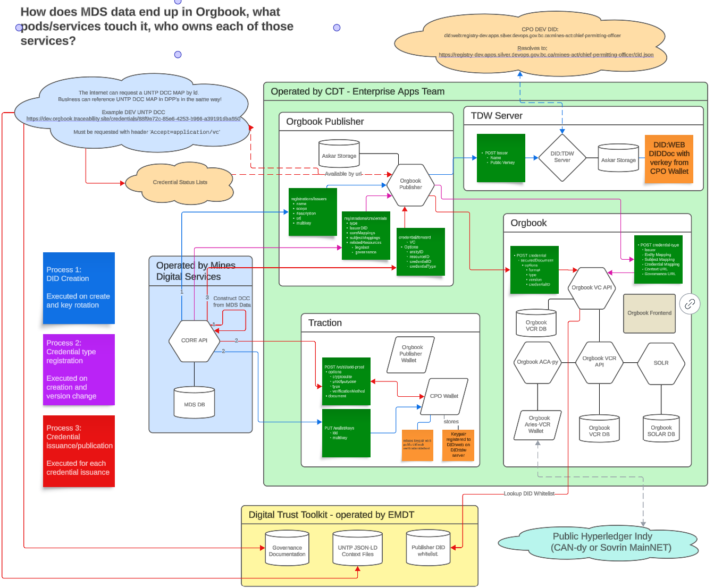

# Verifiable Credentials in Core

The core-api is integrated with [Traction](https://github.com/bcgov/traction). Traction is a multi-tenant solution to provide [Hyperledger Aries](https://www.hyperledger.org/projects/aries) wallets to BC Government offices that want to interact with Verifiable Credentials.

The core-api is enabled to create out-of-band messages([spec](https://github.com/hyperledger/aries-rfcs/tree/main/features/0434-outofband#messages.README.md)) that contain did-exchange ([spec](https://github.com/hyperledger/aries-rfcs/blob/main/features/0023-did-exchange/README.md)) connection invitations.

The core-api is enabled to send credential-offer messages to connected wallets as way of initiating the [issue-credential](https://github.com/hyperledger/aries-rfcs/tree/main/features/0036-issue-credential) protocol.

## AnonCreds

### Governance Documentation

The Mines Act Permit Verifiable Credentials has public [governance documentation](https://github.com/bcgov/bc-vcpedia/blob/main/credentials/bc-mines-act-permit/1.1.1/governance.md) that should be kept up-to-date with any technical or process changes.

### User Flows

#### Connection Establishment

This is abbreviated from the governance documentation above which will supercede this if unclear or out-of-date.

Happy Path UX Flow

1. A user in Minespace can create a connection invitation, this connection will be directly related to the `party` record of the permittee.
1. The user then copies the connection invitation from Minespace
1. The user then provides that connection invitation to their company's digital wallet solution

- The Company's wallet will use the `did-exchange` protocol to establish a connection with the `CHIEF PERMITTING OFFICER OF MINES` (CPO) wallet used by Core.

Current Limitations:

- User can create many invitations until the party has an active connection, however if multiple invitations are created, then multiple are accepted. Multiple active connections may exist between the Company wallet and the CPO Wallet, this should not be allowed. (https://bcmines.atlassian.net/browse/MDS-5986)
- If an active connection exists, do not allow the processing of any further connection requests
- Deleting a connection is not accessible in the UI, It could be done manually by deleting the row in `party_verifiable_credential_connection`, and using the TenantUI (see links below) to delete the connection record in Traction. (This may be needed for POC testing purposes, or if a company made a new corporate wallet.)

#### Credential Issuance

This is abbreviated from the governance documentation above which will supercede this if unclear or out-of-date.

Happy Path UX Flow

1. A user in Core viewing a record with: an open permit, a major mine, and an active digital wallet connection; will see a control to 'Issue Permit as Verifiable Credential"
1. Minespace will indicate to the user that the offer has been sent, and they should inspect their company wallet for the pending credential offer
1. The user will go to their Company's digital wallet and accept the credential offer
1. The two agents will complete the `issue credential` protocol until the credential_exchange record has the state `deleted` (`'deleted'` is successful, and means that the exchange is complete)
1. Minespace will show the credential was issued successfully, and the credential will now be available for presentation in the Company's digital wallet

Current Limitations:

- If the User chooses NOT to accept the credential to their wallet, core-api will recieve a `problem-report` message
- The existence of this problem report should show in the Minespace and Core UI, as well as the text description contained in the problem-report
- Controls and endpoints should be built to allow for a new credential-offer when a problem report has been received on a previous offer

#### Credential Revocation

Happy Path UX flow

1. A Ministry user can navigate to a mine, then the permit tab
1. A new "Digital Permit Credentials" tab, allows Ministry staff to see the veriifable credentials issues for a given permit
1. The ministry user can then select a credential, and hit the 'revoke' button.
1. The corporate wallet of the holder will receive a `revocation-notification` message, CORE will lock the permit such that it shows in the state `revoked` on minespace.
1. If the verifiable credential should become valid again, the ministry user can release the lock, which means the permit record will show as `available` in minespace, so the the proponent can get their veriifable credential again.

#### Permit Amendments and Revocation

When a permit is amended, the previous authorization is no longer valid and the new authorization should be the only valid credential that exists.

After a new permit amendment is created for a permit:

MDS will automatically revoke all verifiable credentials for that permit and offer a new credential with the newest values to the connection on the permitee (if it has one).

### OCA Bundle

The Overlay Capture Architechture (OCA) bundle for this credential is hosted [here](https://github.com/bcgov/aries-oca-bundles/tree/main/OCABundles/schema). The OCA bundle provides infomation on how the credential should be presented, including backgroun colors, labels, data-typing, and localization. If the credential is updated, the OCA bundle may need to be updated to match.

OCA bundles hosted here can be previewed on the [OCA Explorer](https://bcgov.github.io/aries-oca-explorer/)

### Key identifiers and links

As of: Nov 3, 2023, Published by Jason Syrotuck, (JSyro on Github, or jason.syrotuck@nttdata.com)

- The public DID for the `Chief Permitting Officer of Mines` is written to public ledger, these are configured by Traction, but connected partners may ask for these details.

Public DID:

- Dev : [S7S2wzcF2giKuwxdeLBk69](http://test.bcovrin.vonx.io/browse/domain?page=1&query=S7S2wzcF2giKuwxdeLBk69&txn_type=1) on [BCovrin Test](http://test.bcovrin.vonx.io/)
- Test Ledger: [SG22gyoUVsC7TiC9m68ytU](http://test.bcovrin.vonx.io/browse/domain?page=1&query=SG22gyoUVsC7TiC9m68ytU&txn_type=1) on [BCovrin Test](http://test.bcovrin.vonx.io/) (same as dev)
- Prod Ledger: [A2UZSmrL9N5FDZGPu68wy](https://candyscan.idlab.org/tx/CANDY_PROD/domain/321) on [CANdy-Prod](https://candyscan.idlab.org/home/CANDY_DEV)

Schema v1.1.1:

- Dev: `S7S2wzcF2giKuwxdeLBk69:2:bc-mines-act-permit:1.1.1` on BCovrin Test ([TXN](http://test.bcovrin.vonx.io/))
- Test: `S7S2wzcF2giKuwxdeLBk69:2:bc-mines-act-permit:1.1.1` on BCovrin Test ([TXN](http://test.bcovrin.vonx.io/))
- Prod: `A2UZSmrL9N5FDZGPu68wy:2:bc-mines-act-permit:1.1.1` on CANdy-Prod ([TXN](https://candyscan.idlab.org/tx/CANDY_PROD/domain/361))

Credential Definitions for v1.1.1:

- Dev: `S7S2wzcF2giKuwxdeLBk69:3:CL:171126:mds-dev-revok` on BCovrin Test ([TXN](http://test.bcovrin.vonx.io/))
- Test: `SG22gyoUVsC7TiC9m68ytU:3:CL:171126:mds-test-revok` on BCovrin Test ([TXN](http://test.bcovrin.vonx.io/))
- Prod: `A2UZSmrL9N5FDZGPu68wy:3:CL:361:mds-prod-revok` on CANdy-Prod ([TXN](https://candyscan.idlab.org/txs/CANDY_PROD/domain?page=1&pageSize=50&filterTxNames=[]&sortFromRecent=true&search=A2UZSmrL9N5FDZGPu68wy:3:CL:361:mds-prod-revok))

Tenant UI:

- [Dev Traction Tenant UI](https://traction-tenant-ui-dev.apps.silver.devops.gov.bc.ca/)
- [Test Traction Tenant UI](https://traction-tenant-ui-test.apps.silver.devops.gov.bc.ca/)
- [Prod Traction Tenant UI](https://traction-tenant-ui-prod.apps.silver.devops.gov.bc.ca/)

Traction Tenant ID:

- Dev: `fb4090f1-bd27-45a8-9839-d58abdf54e76`
- Test: `cecfcac5-2945-460b-a43b-756c4fe6c017`
- Prod: `7455e995-aacc-4797-a25f-e1f4a2bcdbb8`

Traction API Keys:

- These are not stored here, API keys can be destroyed and replaced if compromised, unlike the Wallet Key, which is immutable.

**Wallet ID and Wallet Key are considered the Admin login for the wallets, they are not stored here but should be stored in a permanent and secure location like a password manager.**

Traction Tenant API:

- [Dev Traction API](https://traction-tenant-proxy-dev.apps.silver.devops.gov.bc.ca/api/doc)
- [Test Traction API](https://traction-tenant-proxy-test.apps.silver.devops.gov.bc.ca/api/doc)
- [Test Traction API](https://traction-tenant-proxy-prod.apps.silver.devops.gov.bc.ca/api/doc)

### Webhook URL

Traction is configured to call the core-api with HTTP requests when protocol events happen. Should these need to be reviewed or changed, navigate to the Tenant UI of the environment you want to view/change and navigate to `/tenant/settings` through the upper-right wallet avatar.

### Core-api Environment Variables

Example Environment Variables needed to connnect to Dev Traction.

```
TRACTION_HOST=https://traction-tenant-proxy-dev.apps.silver.devops.gov.bc.ca
TRACTION_TENANT_ID=fb4090f1-bd27-45a8-9839-d58abdf54e76
TRACTION_WALLET_API_KEY=c664c4c9ad6e4cfe9010f83aea8504e5
CRED_DEF_ID_MINES_ACT_PERMIT=S7S2wzcF2giKuwxdeLBk69:3:CL:171126:mds-dev-revok
TRACTION_WEBHOOK_X_API_KEY=1263835957285d576a09466f2d5f6142
```

These values could be used for local development, however you will not receive webhooks back from Traction unless you create a public tunnel (like NRGROK) and set tractions with that webhook url.

### KNOWN EDGE CASES

What is proponent Delete connection after exchange.
Steps to reproduce:

1. Establish a connection using minespace to a traction agent on a business
1. Issue a credential in minespace on that connection
1. In the business's traction agent, delete the connection

Any future use of that connection will fail. examples of addiitonal actions.

1. Issuing a second permit on that connection
1. Revoking which causes a 'revocation notification' (this is not blocking to the revocation process)

After the connection is gone, what if they want to make a new one.

1. Revoke any credentials issued to the previous connection on that record. Without this step, there may be multiple wallets that can prove they are the holder of the permit.
1. Any records associated with the previous connection should be marked accordingly, unclear if this should be soft-deletion or a new flag.

### AnonCred Schema updates

If we change the schema what do we do with old records?

Options:

- Revoke all old credentials and re-issue new ones, this is likely unnessessary as the old credentials are still valid and there is no guarantee that the company needs to the new attributes of the new credential.

- Enhance Minespace to allow for the permit holder to be issued specific versions of permit, this does not require revocation of the older schema as both are still valid. The holder can choose to delete any credential they don't want.

### Local development testing

Traction DEV is configured to send webhooks to MDS DEV, and to this website for inspection https://webhook.site, after 100 requests, you must create a new testing webhook url and add that to the CPO Dev wallet on traction dev.

You can configure your local MDS to use the CPO Wallet on Traction dev as well (with env variables), but there is no way for the webhooks to get back to your local machine, so to manually test, we need to manually pass the webhook payload from traction, which will send it to webhook.site, then can be copied into Postman (or similar http client) and passed to your localhost api at `http://localhost:5000/verifiable-credentials/webhook/topic/<TOPIC>` as a json body, the topic is parameterized.

## UNTP W3C Credentials

Active development includes signing W3C credentials complaint with the [UN Transparency Protocol](https://uncefact.github.io/spec-untp/) that prove the mines act permit. This would allow a company to produce a **Digital Product Passport** for their goods that make claims about the ESG preformance of the goods and the Mines Act Permit could be used as evidence for those claims.

Mine Permitting Data is being publish into Orgbook. Orgbook holds root credentials issued by BC Registries about BC Businesses. Therefore publishing mining data requires a link to be built between the permittee that exists in CORE, and the business record that BC Registries is attesting to in Orgbook. W3C credentials are not bound to a holder, but simply signed documents that relate to other data (verifiable or not).

**Holder Binding**, how to know the credential on the web is related to the company/person I am connecting with, for BC Business Registration Numbers is still being designed to comply with the [Digital Identity Anchor](https://uncefact.github.io/spec-untp/docs/specification/DigitalIdentityAnchor) specification.

### UNTP Resources

Should the Digital Conformity Credentials need to be updated to a new version, please review the specification found at https://uncefact.github.io/spec-untp/.

- The Chief Permitting is attesting to the existence and good standing of a permit for a registered business in BC. Within the UNTP this is represented as a [Digital Conformity Credential](https://uncefact.github.io/spec-untp/docs/specification/ConformityCredential). Links can be found there for the official JSON-LD schema and context files.

### JSON-LD Crash Course

JSON-LD (JSON w/ Linked Data), allow the json documents to reference their defined shapes and purposes for readers to understand the datatyping, correct structure, and technical and real world meanings. Think of the **Context** file as a glossary, that defines types and the attributes of those typed objects; and the **Schema** file a specific structure on how the typed objects should be structured together to produce the document.

The order that context files are important, as a later file can override a type definition than a previous file in the list, but only where the context files allow (`@protected: false`). Most context vocabularies seen in this context are `protected`.

### VCDM vs AnonCreds

| Feature                    | [AnonCreds](https://hyperledger.github.io/anoncreds-spec/) | VCDM2.0                    |
| -------------------------- | ---------------------------------------------------------- | -------------------------- |
| Data Structure             | Flat                                                       | JSON                       |
| Issued                     | Directly to Holder and bound                               | Published to be Discovered |
| Selective Disclosure (ZPK) | Supported                                                  | Not Supported              |
| DID Methods                | did:indy                                                   | did:web, did:tdw           |
| Artifact hosting           | Hyperledger Indy                                           | Hosted by each participant |

#### Relevant Context Files (IN ORDER)

1. [W3C VCDM 2.0](https://www.w3.org/TR/vc-data-model-2.0/) is another specificiation for Veriifable Credentials, is an alternative to AnonCreds. Avoiding a very long section, here is an incredibly brief comparison that compares the two

1. [UNTP DCC Specification](https://uncefact.github.io/spec-untp/docs/specification/ConformityCredential) is a context file that describes all the types described in the UNTP specification.

1. [BC Mines Permit Credential]() is a context file that extends the UNTP DCC specification, allowing BC to add key attributes that are valuable to the subjects (the mines/permits)

The top level of the credential produced is currently typed with all three because, and because all the attributes in all the context files are `protected` no attributes can conflict. AKA. Context files can add attributes to protected types, but cannot redefine an existing term.

### Data Architechture



### Mines Digital Services

General Purpose: To manage the mining data in BC

### Digital Trust Toolkit

General Purpose: To host critical artifacts for reference by BC Government VC Issuers, as well as instructional material for business experts of interested government issuers.

NOTE: This service is also responsible for maintaining the whitelist [files](https://github.com/bcgov/digital-trust-toolkit/tree/main/related_resources/registrations/issuers) that Orgbook leverages to control what did's are allowed to issue.

### Orgbook Publisher

General Purpose: To support publishing of Government data as JSON-LD Credentials to Orgbook for BC Businesses (including did's)

### DID:TDW Server

General Purpose: To host did's for BC government entities, specifically did:web and did:tdw

### Aries VCR VC API

General Purpose: New REST API to add support for JSON-LD verifiable credentials to Orgbook

### Orgbook

General Purpose: To hold verifiable data about BC Businesses.

### UNTP Digital Product Passports

Business will produce

## Who to call

### Energy and Mines Digital Trust

Key Contacts:

- Nancy Norris, nancy.norris@gov.bc.ca, Senior Director
- Bree Blazicevic, bree-ana.blazicevic@gov.bc.ca, Senior Policy Analyst
- Patrick St-louis, patrick.st-louis@opsecid.ca, Developer

Oversees Repository:

- [Digital Trust Toolkit](https://github.com/bcgov/mds/pull/3320/files)

### Cybersecurity and Digital Trust Enterprise Apps Team

Key Contact:

- Emiliano Sune, emiliano.sune@quartech.com
- Stephen Curran, swcurran@cloudcompass.ca

Oversees Deployments of:

- [Traction](https://github.com/bcgov/traction)
  - Deployed [here](https://traction-tenant-ui-prod.apps.silver.devops.gov.bc.ca/) with [API](https://traction-tenant-proxy-prod.apps.silver.devops.gov.bc.ca/api/doc)
- [Orgbook Publisher](https://github.com/OpSecId/orgbook-publisher/)
  - Deployed [here](https://dev.orgbook.traceability.site/)
  - This is about to move to an openshift domain
- [Aries-VCR-VC-Service](https://github.com/bcgov/aries-vcr-vc-service/pull/17)
  - Deployed [here] , trying to find
- [Aries-VCR](https://github.com/bcgov/aries-vcr)
  - Deployed as Orgbook [here](https://orgbook.gov.bc.ca/search) and [API](https://orgbook.gov.bc.ca/api/v2)
- [TDW Server](https://github.com/decentralized-identity/trustdidweb-server-py)
  - Deployed [here](https://registry-dev.apps.silver.devops.gov.bc.ca/)
