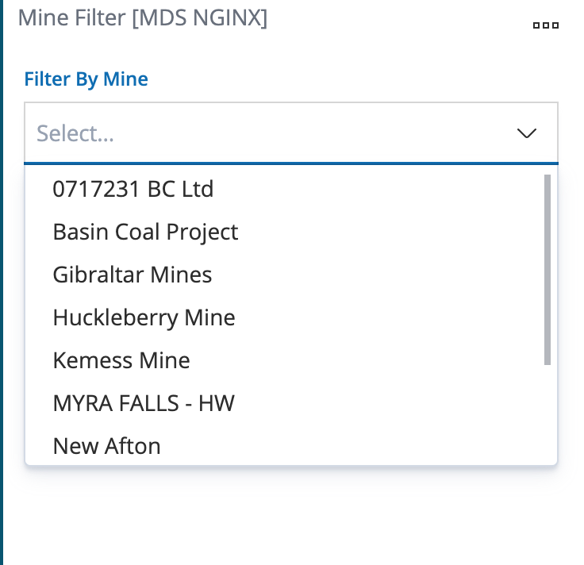
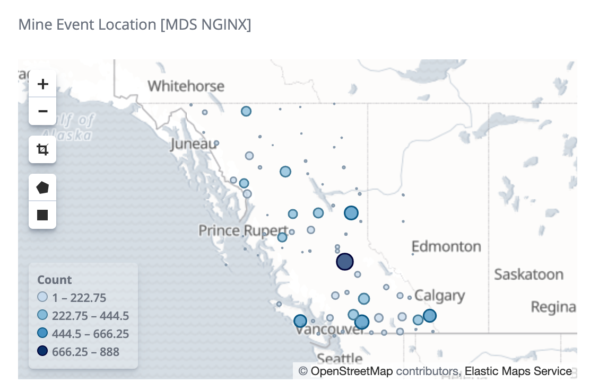
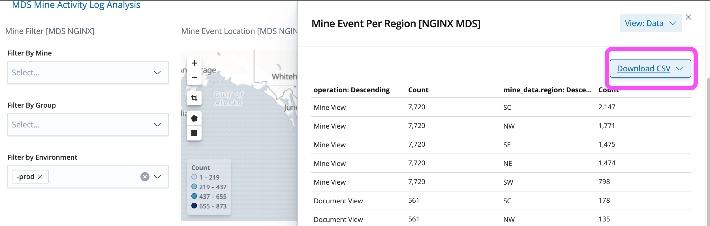

# Mines Digital Services - Elasticsearch

## Documentation for MDS dashboards

This file describes how to manage and use the different dashboards in Kibana provided as part of the MDS project. There is also an explanation of some useful built-in features of Kibana as well.

## Viewing Dashboards

First login to Kibana and then navigate to the Dashboards section:

As you can see above, this documentation is only concerned with the [MDS]
prefixed dashboards, as these are the dashboards delivered for the MDS project.

All dashboards consist of a set of different visualizations that were implemented and configured for this project. The data that these dashboards display depends on the NGINX logs that were provided to the ingest layer of the Elastic Stack. Indexes can be viewed in the Index Management screen in the Management section of Kibana.

## Filters

Instead of queries, for simple data analysis and data manipulation users can add filters to filter on certain types of data that are valuable for them i.e. they can specify that they only want to see data for a particular mine, in which case they would create a filter for the mine name or mine ID. This would filter out all data that is not relevant for that particular mine. To delete the filter, simply hover over the filter tab at the top of the dashboard and delete the filter.

All dashboards that were delivered for this project have had filtering capabilities added, if filtering was considered relevant. They typically also have important metrics at the top of the page for the event totals (i.e. total number of mine views, mine edits, etc.) These totals change depending on what filter the user selects. By default with no filter the user is looking at all mines.
#### Note: It is extremely important to make use of the Time Range in the top right corner of the screen as illustrated in the following screenshot, which is default set to the "Last 90 days":

Since Elasticsearch is primarily dealing with time series data, it is important to make sure you are looking at data for the right time range you want to be looking at. If you only want to look at today's data, go to Quick > and choose "Today." Similarly, you can choose "This Year" to look at the Dashboards containing the data from the entire year.

## Dashboards

There are 5 dashboards delivered with this project:

Mine Activity Cloud Tags

Mine Activity Overview

Mine Activity Logs Overview

Mine Activity Access and Error Logs

Mine Activity Log Analysis

### Common features of all 5 dashboards

At the top left of the page in every dashboard, notice there are hyperlinks to all the different dashboards delivered for this project. This is included in all the dashboards and is a way to navigate to the different dashboards relevant for CORE and MS users.

Below the hyperlinks that link to each dashboard delivered in this project, you will find the "Filter By Mine" filter. We have created a custom Filter that is in all Dashboards delivered for this project. In all 5 Dashboards, we have included the ability to filter by: Mine, Group (Core and MS,) and by environment. Typically, Prod is the environment we want to be looking at, which is why it is currently set as a default.

Example of selecting a Mine from the Mine Filter and dropdown:

After the mine is selected from the dropdown, watch as the total number of different events drops and the graphs and charts update to reflect all the data that has now been filtered out.

At the top right of the page there are the sum totals of the Mine View, Doc View, Doc Update, and Mine Update type events for a given time range (depending on the time range that users specify in the top right corner.)

### Dashboard 1: Mine Activity Cloud Tags

Here is the dashboard:

Below the sum totals of all events, there are 5 different containers for Cloud Tags included in this dashboard:

[MDS] - All Mine Event Tags: Activity By Event Type

The first visualization below the Mine Event Metric visualization at the very tope is the All Mine Event Tags. The larger the font size, the higher the number of times this event occurred. A maximum of 5 Cloud Tags are displayed here, representing the top 5 in order of occurrence for the MDS site. The Mine View event will typically be the largest since a user has to view a mine before they edit, and because many users are not editing mine information they may be simply viewing it. Similarly, updating documents is typically going to be a lot smaller or not visible because there may be no document updated for a given time period.

For the next 4 visualizations, the names of mines that have had activity are displayed. The top 5 mines for a particular type of activity are displayed, the cloud tags vary in size and the larger the name, the more of that activity that has occurred for that mine in a given time period:

Mine View Activity

Mine Edit Activity

Document View Activity

Document Update Activity

### Dashboard 2: Mine Activity Overview

This dashboard was created to represent an overview of all mine activity. This should be considered the primary source of data when it comes to mine activity as this dashboard provides:
1. Geographical representation of the event data
2. Tabular data representation including user name and event type
3. Graphs that indicate hourly and daily activity by group.

#### Mine Activity Event Map:

This visualization allows the user to view a heatmap where the circles represent mine activity (Mine views, edits, document views, etc) performed on the website. The more activity there is for a particular mine on the website and application, the larger the circles become. There is a drilldown option that allows the user to zoom in on any region of the map they want to have a closer look.

There is also the region select feature for the map. The user should select the polygon lasso tool and select a region of the map as illustrated by the following screenshot. After a region is selected, all events outside of the selection are filtered out (for the entire dashboard!) To remove the filter to view data for all the mines again, simply delete or disable the filter at the top of the page.

To set a region filter the polygon or square tool is chosen and then the user should select a region of the map, this will automatically filter out all event data outside of that geographical region:

To remove this region filter, go to the top of the dashboard and delete the filter that has the longitude and latitude coordinates for the region filter.

After selecting a region filter or multiple region filters there will be less data in the dashboards due to the filter. Please notice the rest of the dashboard visualizations have been updated as a filter has been applied by filtering on a region of data)

Here is an example of the map after some region filters have been applied. Notice the event circles are gone around a certain region; this is because the polygon tool was used to filter out all the regions outside the selected region:

#### Mine Activity Event Type Timeline:

This graph shows the different events over time. As you can see, event types are colour coded. In the screenshot please note that Mine Read has the highest volumes.

#### Group Access

We have broken out timestamps of events throughout the day and then we have blue representing the CORE user group and the magenta representing the MS group. The magenta bar represents how many events the MS group have generated which is to the right of the blue bar which represents the CORE group events, i.e. if there is no magenta bar for a time period then there were no events generated by activity from the MS group. If they are the same size, that means there was an equal amount of activity (i.e. the blue bar is never overlapping the magenta bar in the visualization.)

#### Mine Activity Per Region:

The following is a pie chart that separates all regions and provides the mine activity breakdown by event type for each respective region (NE, SW, NW, SE.)

### Dashboard 3: Mine Activity Logs Overview

This visualization provides a breakdown of HTTP response codes over time from NGINX. There are data overlays where Green represents 200 errors (success,) whereas red for example represents 400 errors. The response codes and error over time graphs are useful in seeing spikes in error activity for specific time frames.

The Operating System of users engaged in mine activity, as well as the browser breakdown by OS, are shown in two pie charts.

Below that are the top pages accessed according to the data contained in the MDS NGINX logs.

### Dashboard 4: Mine Activity Access and Error Logs

This visualization is useful for seeing spikes in access logs and volumes of access log data over time.

### Dashboard 5: Mine Activity Log Analysis

## Useful Features

### Adding Filters

The user can add additional filters by clicking on the "Add a Filter" button above the Dashboard. The filter can be edited, disabled, and be used for saved searches. This is a very useful tool for filtering large datasets at very high speed and is much, much faster than writing queries since it is done in a few clicks.

### Creating a filter directly on a dashboard

Adding a filter can be easy as a single click on a number or word in a dashboard visualization. Here is how we can filter a dashboard by simply clicking on its contents:

We will click on the "Wolverine" mine in the MDS Mine Event Tag Clouds dashboard.

After clicking on "Wolverine" in the cloud tags, the dashboard  automatically filters out all data that is not relevant to the Wolverine mine.

### Create a filter in Discover

Here is a step-by-step guide to creating filters:

1. Go to Discover window select add filter
2. Select your filter field
3. Apply the condition ex: IS
4. Select the value you wanted to filter
5. If you want to delete the filter hover over it on the filter tab you will get delete option and then delete it. (In the same way you can edit the filter as well by selecting edit option.)

#### Custom filters delivered with MDS dashboards

In addition to the built in filtering features of Kibana & Elasticsearch, we have created a custom Filter that is included in all Dashboards delivered for this project. In all Dashboards we have included the ability to filter by: Mine, Group (Core and MS,) and by environment (Prod, Dev, etc.) Typically, Prod is the environment we want to be looking at and by default we should be using the Prod filter.

### Export to Excel / Download CSV

For every visualization, the user can select "Inspect" from the Dashboard. This will navigate the user to the visualization. From there, the button for "Download CSV" can be clicked and the CSV file will be downloaded with the current data contents of that visualization, as illustrated by the following screenshot:

