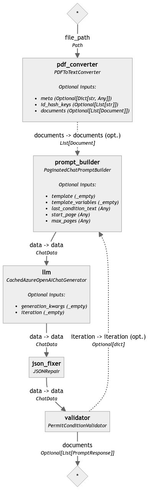

# Permit Service

## Overview

The Permit Service is a question-answering (QA) service built on top of deepset-ai's [Haystack framework](https://haystack.deepset.ai/overview/intro). This service leverages state-of-the-art natural language processing (NLP) models to digitize and index Mines Act Permits, and make them discoverable, searchable, and queryable.

## Features

- **Permit Condition Extraction**: The service provides functionality to extract conditions from Permit PDFs, and scripts to validate the extracted conditions to manually extracted ones
- **Indexing**: Users can use the API to index Permit PDFs to make them searchable
- **OCR**: PDFs can contain either text or images. In case of an Image, the service will use [tesseract-ocr](https://tesseract-ocr.github.io/) to extract text from the PDF
- **NLP Models**: Utilizes deepset-ai's Haystack framework, which supports a variety of powerful NLP models to index the documents
- **Querying**: The service is designed to answer questions posed by users in natural language
- **REST API**: The service exposes Haystack's REST API, that can be used to index documents, query documents, and leave feedback on results
- **Kibana**: The service indexes document in Elasticsearch, and you can use the provided Kibana instance to browse the search index directly.

## Getting Started

### Prerequisites

- Docker
- docker-compose

### Installation

1. Clone the repository:

   ```bash
   git clone https://github.com/bcgov/mds
   ```

2. Start the service:

   ```bash
   make permits
   ```

The service should now be running and ready to accept user queries. Note: It can take a couple of minutes for all the services to start (especially elasticsearch can be slow to spin up).

## Usage

Swagger docs for the service can be found at [http://localhost:8004/docs](http://localhost:8004/docs).

### Key endpoints

_Index document_
`POST http://localhost:8004/permit/index`

This takes in a PDF file and run it through the `indexing` pipeline defined in `app/app.py`. Note: This can take a while depending on your specs.

_Query_
`POST http://localhost:8004/permit/query`
This endpoint receives the question as a string and allows the requester to set additional parameters that will be passed on to the Haystack query pipeline defined in `app/app.py`. The endpoint performs a Keyword search on indexed documents.

### Kibana

Kibana can be accessed at http://localhost:5601/.

If Kibana prompts you to enter an address for elasticsearch, put in https://elasticsearch:9200. No further setup should be necessary in order to use the app.

In order to view documents in Kibana:

1. Navigate to `Analytics -> Discover`
2. Create a Data View with the Index pattern `permits`

### Permit indexing

The `import_permits.py` utility script is provided to index Permits in bulk from a `csv` file. This script will download the given files
from the source S3 bucket, index the files with the target permit service, and associate the given metadata with the record.

Example usage:

```python
python import_permits.py permits.csv
```

The following environment variables are required:

- OBJECT_STORE_ACCESS_KEY_ID <- ID of S3 access key of the bucket the PDF should be downloaded from
- OBJECT_STORE_ACCESS_KEY <- S3 secret key of the bucket the PDF should be downloaded from
- OBJECT_STORE_HOST
- OBJECT_STORE_BUCKET <- Name of bucket the permit PDFs should be downloaded from
- PERMIT_SERVICE_ENDPOINT <- Endpoint of permit service documents should be indexed with
- PERMITS_CLIENT_ID
- PERMITS_CLIENT_SECRET
- JWT_OIDC_WELL_KNOWN_CONFIG

Example CSV format:

```csv
mine_no,mine_name,permit_no,object_store_path,issue_date,document_name,permit_amendment_guid,permit_amendment_id,description
123,mine1,1234,permits/1234/1234.pdf,2021-01-01,1234.pdf,1234,1234,This is a permit
```

An example query to generate this CSV can be found in the [Metabase Permit Digitization Candidates Metabase collection](https://metabase-4c2ba9-prod.apps.silver.devops.gov.bc.ca/question/2890-mds-permit-digitization-candidates)

### Permit Condition Extraction

_Extract Conditions_

`POST http://localhost:8004/permit/extract_conditions`

`POST http://localhost:8004/permit/extract_conditions/csv`

The `extract_conditions` endpoint takes in a PDF file and extracts the conditions from the PDF. The endpoint returns the extracted conditions as a JSON object. The `extract_conditions/csv` endpoint returns the extracted conditions as a CSV file.

The extraction process is done using a haystack pipeline with Azure OpenAI GPT4 doing the heavy lifting.

#### Steps

The pipeline consists of the following steps


1. PDFToTextConverter: Converts the PDF to text using PyPDF. Currently only supports text-based PDFs. It extracts each page as a separate "document" that is passed to the next step.
2. PaginatedChatPromptBuilder: Takes the text from the PDF and builds a paginated chat prompt using the template defined in [app/permit_condition_prompts.yaml](app/permit_condition_prompts.yaml)
3. CachedAzureOpenAIGPT4Generator: Uses Azure OpenAI GPT4 to generate the conditions from the paginated chat prompt. GPT4 can max return 4096 tokens at a time, so functionality is built in here to automatically "continue" the prompt if the response is to big (GPT4 returns a finish_reason of "length").
4. JSONRepair. Fixes the JSON response from GPT4 to be a valid JSON object. Sometimes the response from GPT4 is not valid JSON, so this step attempts to fix it (e.g. has an extra " or a missing bracket)
5. PermitConditionValidator. Validates that the extracted conditions are in a valid JSON format, if there are outstanding pages to be processed, it will pass this information back to the PaginatedChatPromptBuilder to continue from the last page processed.

#### Validation

The extracted conditions can be validated against manually extracted conditions using `extract_and_validate_pdf.py` script. This script takes in a PDF file and a CSV file with the expected conditions. The script will extract the conditions from the PDF and compare them to the expected conditions in the CSV file, and output a csv and html repot of the results

Usage:

```python
python -m app.extract_and_validate_pdf --pdf_csv_pairs <pdf_path> <expected_csv_path> --pdf_csv_pairs <pdf_path> <expected_csv_path> ...
```
